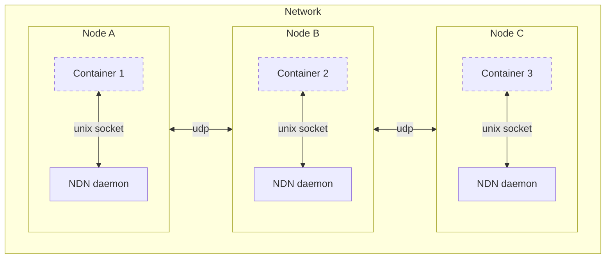

# NDN Operator

**NDN Operator** is a Kubernetes operator that integrates [Named Data Networking](https://github.com/named-data) into your Kubernetes cluster

## Install
```shell
helm repo add ndn-operator https://ndn-operator.github.io/ndn-operator
helm repo update
helm install ndn-operator-crd ndn-operator/ndn-operator-crd
helm install ndn-operator ndn-operator/ndn-operator
```
## Create your first ndn network

```shell
kubectl create ns mynetwork
kubectl apply --namespace mynetwork \
    -f https://raw.githubusercontent.com/ndn-operator/ndn-operator/refs/heads/main/examples/minimal/network.yaml
```

### Pingserver
Producers and consumers may live in different k8s namespaces from the network, and from each other
```shell
kubectl apply -f https://raw.githubusercontent.com/ndn-operator/ndn-operator/refs/heads/main/examples/minimal/producer-pod.yaml
```

```shell
kubectl apply -f https://raw.githubusercontent.com/ndn-operator/ndn-operator/refs/heads/main/examples/minimal/consumer-job.yaml
```

## Architecture
NDN Operator has two main services:
* Controller. It utilizes DaemonSets to configure and run `ndnd` on each node
* Injector. It uses mutating webhooks to mount ndnd socket into every pod with label `named-data.net/inject: "true"`


## Features
* Multiple networks per cluster
* TLS management for ndnd
* Multi-cluster support

## Roadmap
1. Basic functionality ✅
    * `Network` resource that creates a simple unsecured network
    * Pod annotations, assigning it to a particular network
1. TLS 🚧
    * Self-signed root CA
1. Advanced use ⏳
    * Expose NDN faces outside
    * Obtain certificates from Testbed
    * K8S resources to manage NDN faces, strategies and links
