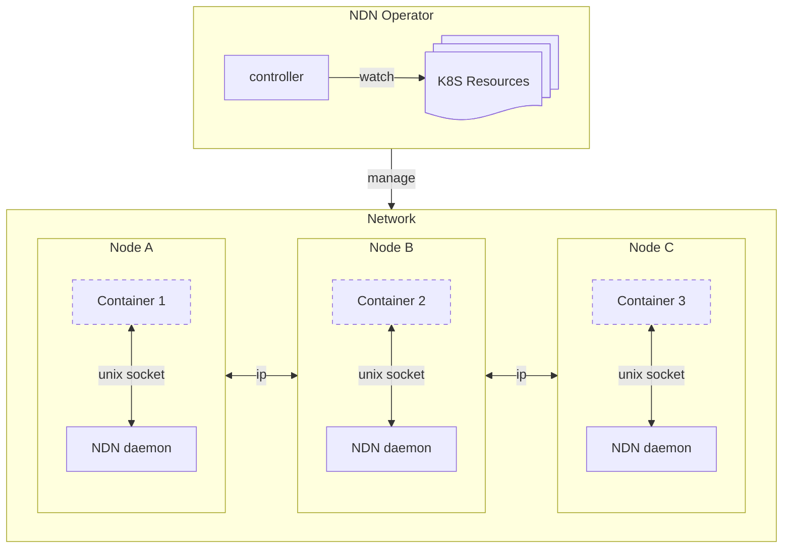

# NDN Operator

**NDN Operator** is a Kubernetes operator that integrates [Named Data Networking](https://github.com/named-data) into your Kubernetes cluster

## Install
```
helm repo add ndn-operator https://ndn-operator.github.io/ndn-operator
helm install ndn-operator-crd ndn-operator/ndn-operator-crd
helm install ndn-operator ndn-operator/ndn-operator --namespace ndn --create-namespace
```
## Create your first ndn network
network.yaml:
```yaml
apiVersion: named-data.net/v1alpha1
kind: Network
metadata:
  name: test
spec:
  prefix: /test
  udpUnicastPort: 6363
```
```
kubectl apply -f network.yaml
```

### Pingserver
pod.yaml:
```yaml
apiVersion: v1
kind: Pod
metadata:
  name: test-pingserver
  annotations:
    networks.named-data.net/name: test
  labels:
    named-data.net/inject: "true"
spec:
  containers:
  - name: server
    image: ghcr.io/named-data/ndnd:latest
    command: ["/ndnd", "pingserver"]
    args: ["/test/pingserver"]
```
```
kubectl apply -f pod.yaml
```

job.yaml:
```yaml
apiVersion: batch/v1
kind: Job
metadata:
  name: test-ping
spec:
  template:
    metadata:
      annotations:
        networks.named-data.net/name: test
      labels:
        named-data.net/inject: "true"
    spec:
      restartPolicy: Never
      ttlSecondsAfterFinished: 600
      containers:
      - name: ping
        image: ghcr.io/named-data/ndnd:latest
        command: ["/ndnd", "ping"]
        args: ["/test/pingserver", "--interval", "5000", "--count", "20"]
```

## Architecture


## Features
* Multiple networks per cluster
* TLS management for ndnd
* Multi-cluster support

## Roadmap
1. Basic functionality
    * `Network` resource that creates a simple unsecured network
    * Pod annotations, assigning it to a particular network
1. TLS
    * Self-signed root CA
1. Advanced use
    * Expose NDN faces outside
    * Obtain certificates from Testbed
    * K8S resources to manage NDN faces, strategies and links