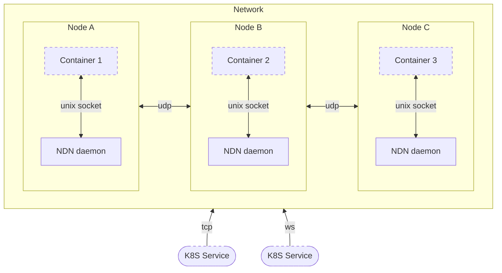

# NDN Operator

[](https://codecov.io/github/ndn-operator/ndn-operator)

[](https://rust-reportcard.xuri.me/report/github.com/ndn-operator/ndn-operator)


[](https://doc.crds.dev/github.com/ndn-operator/ndn-operator)

**NDN Operator** is a Kubernetes operator that integrates [Named Data Networking](https://github.com/named-data) into your Kubernetes cluster

## Install
```shell
helm repo add ndn-operator https://ndn-operator.github.io/ndn-operator
helm repo update
helm install ndn-operator ndn-operator/ndn-operator \
    --namespace ndn-operator --create-namespace
```
## Create a secured NDN network

### Namespace
```shell
kubectl create ns mynetwork
```
### Self-signed certificate
```
kubectl apply --namespace mynetwork \
    -f https://raw.githubusercontent.com/ndn-operator/ndn-operator/refs/heads/main/examples/secure/self-signed-cert.yaml
```
### Secured network
```shell
kubectl apply --namespace mynetwork \
    -f https://raw.githubusercontent.com/ndn-operator/ndn-operator/refs/heads/main/examples/secure/network.yaml
```
### Signed helloworld application
Producers and consumers may live in a different Kubernetes namespace from the
Network. Application credentials are created in the workload namespace because
Kubernetes cannot mount Secrets across namespaces:

```shell
kubectl create namespace ndn-workloads
kubectl apply --namespace ndn-workloads \
    -f https://raw.githubusercontent.com/ndn-operator/ndn-operator/refs/heads/main/examples/workloads/application-certificates.yaml
```

Run the signed Rust producer and its validating consumer in that namespace:

```shell
kubectl apply --namespace ndn-workloads \
    -f https://raw.githubusercontent.com/ndn-operator/ndn-operator/refs/heads/main/examples/workloads/producer-pod.yaml
```
```shell
kubectl apply --namespace ndn-workloads \
    -f https://raw.githubusercontent.com/ndn-operator/ndn-operator/refs/heads/main/examples/workloads/consumer-job.yaml
```

The workload image is built by `ndn-helloworld-rs`, a Rust producer/consumer
application based on `Quarmire/ndn-rs` pinned at
`991ab06233d0b7596eda30e70fe069659be50042`. The consumer verifies ECDSA
signatures and an embedded LVS policy, so successful routing is not mistaken
for authenticated Data acceptance.

## Share routing across application prefixes

`Network.spec.prefix` is the application prefix injected into attached
workloads. Set `Network.spec.dvNetwork` when distinct Networks should exchange
routes in the same `ndnd` distance-vector domain. For example,
`/root-network/subnetwork1` and `/root-network/subnetwork2` can both set
`dvNetwork: /root-network`.

When `dvNetwork` is omitted, it defaults to `spec.prefix`. This differs from
older operator versions, which constructed the `ndnd` routing domain from the
Network resource name. Existing examples such as `name: test` with
`prefix: /test` retain the same routing domain.

See `examples/subnetworks/local` for a secured two-Network example runnable on
a single Rancher Desktop Kubernetes node.

## Application credential injection

An injected Pod may opt into application credentials for one named container:

| Annotation | Purpose |
| --- | --- |
| `credentials.named-data.net/container: <container-name>` | Selects the only container receiving credential mounts. |
| `credentials.named-data.net/signing: <Kind>/<name>` | Mounts a private key and leaf certificate for signing. |
| `credentials.named-data.net/trust-anchors: <Kind>/<name>[,...]` | Mounts explicitly trusted public roots. |
| `credentials.named-data.net/certificate-chain: <Kind>/<name>[,...]` | Mounts untrusted public chain certificates. |

`Kind` is `Certificate` or `ExternalCertificate`; references resolve in the
Pod namespace. The injector exposes the resolved material through:

```text
NDN_APP_SIGNING_KEY_FILE=/etc/ndn/app/signing/ndn.key
NDN_APP_SIGNING_CERT_FILE=/etc/ndn/app/signing/ndn.cert
NDN_APP_TRUST_ANCHOR_DIR=/etc/ndn/app/trust-anchors
NDN_APP_CERTIFICATE_CHAIN_DIR=/etc/ndn/app/certificate-chain
```

The existing socket injection variables `NDN_CLIENT_TRANSPORT` and
`NDN_PREFIX` remain available to every injected application container.

## Architecture
NDN Operator has two main services:
* Controller. It utilizes DaemonSets to configure and run `ndnd` on each node
* Injector. It uses mutating webhooks to mount ndnd socket into every pod with label `named-data.net/inject: "true"`

```mermaid
flowchart BT
  subgraph N[Network]
  direction LR
    subgraph r_A[Node A]
    direction TB
      app_a1[Container 1]:::dotted <--unix socket--> ndnd_a1[NDN daemon]
    end
    subgraph r_B[Node B]
    direction TB
      app_b1[Container 2]:::dotted <--unix socket--> ndnd_b1[NDN daemon]
    end
    subgraph r_C[Node C]
    direction TB
      app_c1[Container 3]:::dotted <--unix socket--> ndnd_c1[NDN daemon]
    end
    r_A <--udp--> r_B <--udp--> r_C
  end
  s1([K8S Service]):::dotted --tcp--> N
  s2([K8S Service]):::dotted --ws--> N
  classDef dotted stroke-dasharray: 5 5
```

## Features
* Multiple networks per cluster
* TLS management for ndnd
* Multi-cluster support

## Controller runtime flags
The main controller binary (`ndnctl`) accepts flags to decide which reconciler loops should run. When no flags are provided, every controller is enabled. Provide one or more of the following to run a subset:

```shell
ndnctl --nw --rt            # Run network and router controllers only
ndnctl --cert               # Run certificate controller only
ndnctl --neighbor --pod     # Run neighbor and pod-sync controllers
```

## Roadmap
1. Basic functionality ✅
    * `Network` resource that creates a simple unsecured network
    * Pod annotations, assigning it to a particular network
1. TLS ✅
    * Self-signed root CA
    * External Certificates (from Testbed)
1. Advanced use
    * Expose NDN faces outside ✅
    * K8S resources to manage NDN faces, strategies and links 🚧
